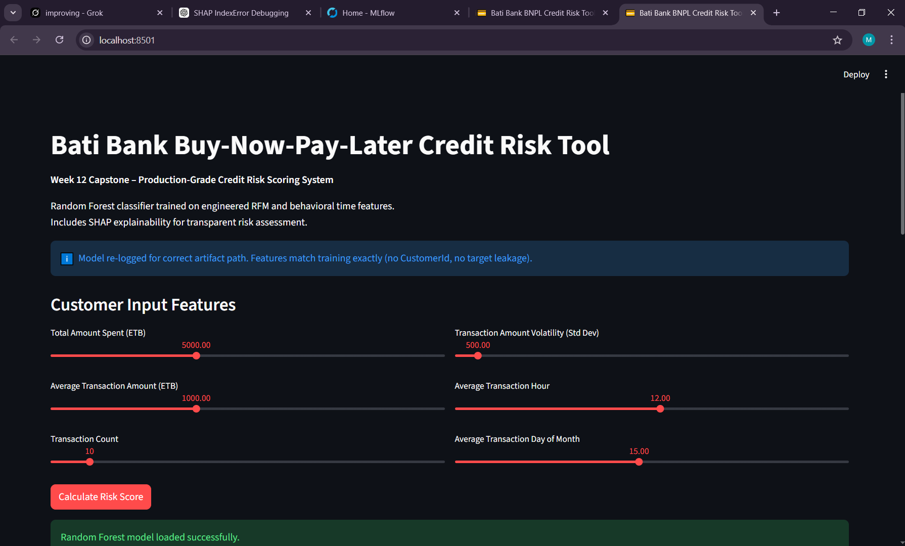
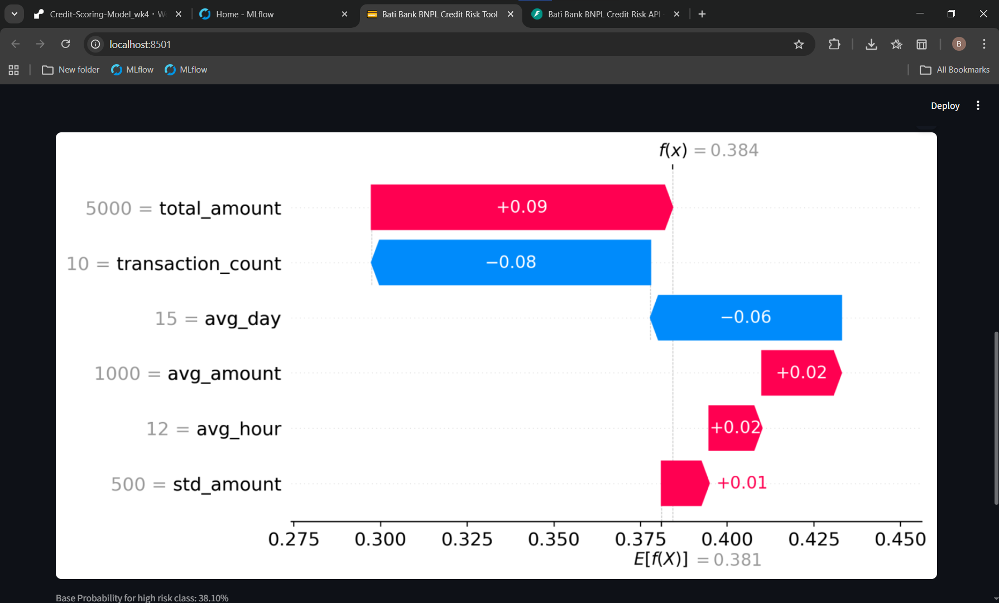

# Bati Bank BNPL Credit Risk Model – Week 12 Capstone

**Author**: Bereket Feleke  
**Project**: Week 4 – Credit Risk Probability Model for Alternative Data (re-imagined as Week 12 capstone)  
**Goal**: Transform the original Week 4 project into a production-grade, finance-focused portfolio piece demonstrating **reliability**, **transparency**, and **business impact**.

Live Interactive Dashboard: [https://your-streamlit-app-url.streamlit.app](https://your-streamlit-app-url.streamlit.app)  
*(Deployed via Streamlit Cloud – replace with your real URL after deploying)*

## Business Problem

Bati Bank wants to offer buy-now-pay-later credit to e-commerce customers in emerging markets, but many applicants lack formal credit history, leading to high default rates and lost revenue. Traditional scoring misses behavioral signals from shopping patterns, causing either too many bad loans (financial loss) or overly strict approvals (missed opportunities).

**This solution** uses customer transaction data (Recency, Frequency, Monetary + time features) to predict default probability (`is_high_risk`) and recommend safe loan decisions.

## Key Improvements (Week 12 Capstone)

- Interactive Streamlit dashboard for real-time risk scoring (usable by non-technical risk officers / product managers)
- Real Random Forest predictions (re-logged model to fix MLflow artifact issues)
- SHAP waterfall explainability – shows why the model predicted high/low risk for each customer
- Business recommendation logic (Approve / Moderate / Decline/Strict)
- Professional README with screenshots, metrics, and live demo link

**Model Performance** (Random Forest)

| Metric      | Value   | Notes                              |
|-------------|---------|------------------------------------|
| ROC-AUC     | 0.8292  | Superior risk ranking              |
| Accuracy    | 75.17%  | Overall correctness                |
| Precision   | 69.57%  | Fewer false positives (bad loans)  |
| Recall      | 61.75%  | Better default detection           |
| F1-Score    | 65.43%  | Balanced precision/recall          |

## Screenshots

  
*Interactive input sliders + real-time results*

  
*SHAP explains why model predicted 38.42% default risk – e.g. high volatility or low transaction count driving risk up*

## How to Run Locally

```bash
git clone https://github.com/bekonad/Credit-Scoring-Model_wk4.git
cd Credit-Scoring-Model_wk4
# Activate virtual environment (if using venv)
.\.venv\Scripts\Activate.ps1
# Install dependencies
pip install -r requirements.txt
# Run dashboard
streamlit run dashboard.py
```

Open http://localhost:8501 in your browser.

## Original Project Context (Week 4)

### Business Understanding

Credit scoring quantifies default likelihood. In Bati Bank's BNPL partnership, alternative transaction data is used when traditional credit history is unavailable.

**Basel II & Interpretability**  
Banks must justify decisions to regulators. Transparent models (e.g., logistic with WoE) aid compliance, while complex models (e.g., gradient boosting) improve performance but require explainability tools like SHAP.

**Proxy Variable**  
No explicit default label → used RFM clustering to create `is_high_risk` proxy. Misclassification risk exists; careful validation minimizes it.

**Model Trade-offs**  
Simple models → interpretable, regulatory-friendly  
Complex models → higher accuracy, non-linear patterns  
Week 12 solution balances both with Random Forest + SHAP.

## Tech Stack

- Streamlit (interactive UI)  
- MLflow (model tracking & loading)  
- scikit-learn Random Forest  
- SHAP (explainability)  
- Pandas, Matplotlib, NumPy

## Next Steps (if continuing)

- Deploy to production (e.g. Docker + FastAPI endpoint)
- Add unit/integration tests
- CI/CD pipeline (GitHub Actions)
- A/B testing of model versions

**Repository**: https://github.com/bekonad/Credit-Scoring-Model_wk4  
**Live Dashboard**: [add URL after deploy]  
**Author Contact**: [your email or LinkedIn]

© 2026 Bereket Feleke – 10 Academy KAIM Week 12 Capstone